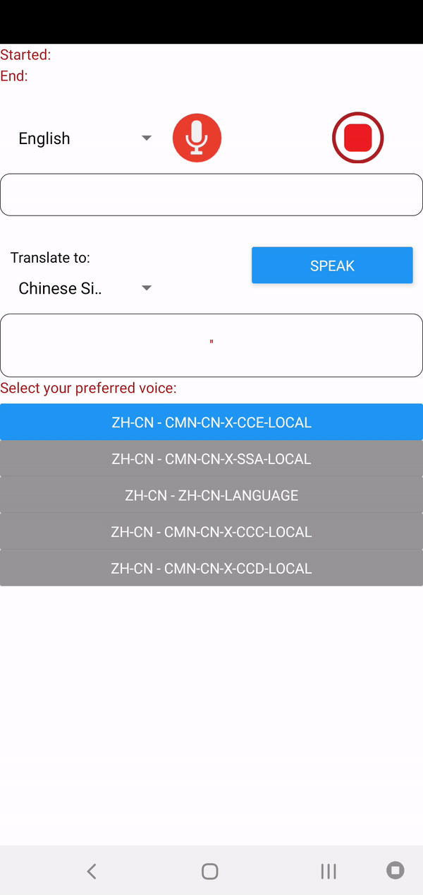

<h1 align="center">React Native Translation App</h1>

**Note that I've only tested on _Android_**

<a href="https://youtu.be/4lf0u60kEcY">Video Documentation</a>

## Contents

- [How To Use](#-how)
- [Dependencies](#-dependencies)

<h2 align="center">How To Use</h2>

<h2 align="center">Dependencies</h2>

The main dependencies used for this App is <a href="https://github.com/react-native-community/react-native-voice">react-native-voice</a>, <a href="https://github.com/danialkalbasi/react-native-power-translator">react-native-power-translator</a> and <a href="https://github.com/ak1394/react-native-tts">react-native-tts</a>

